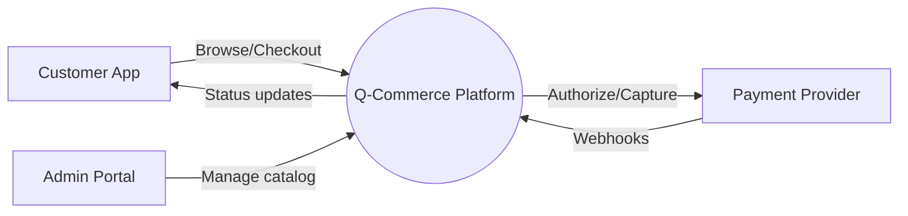
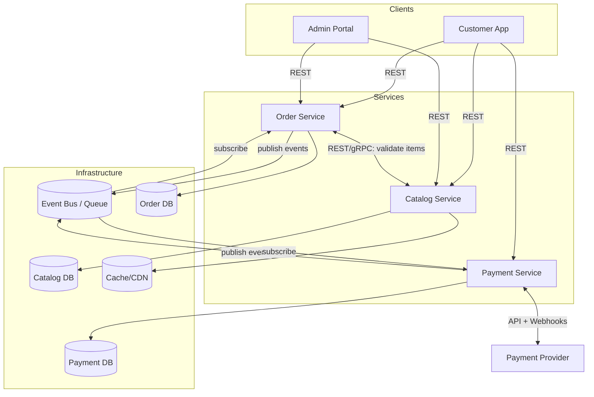
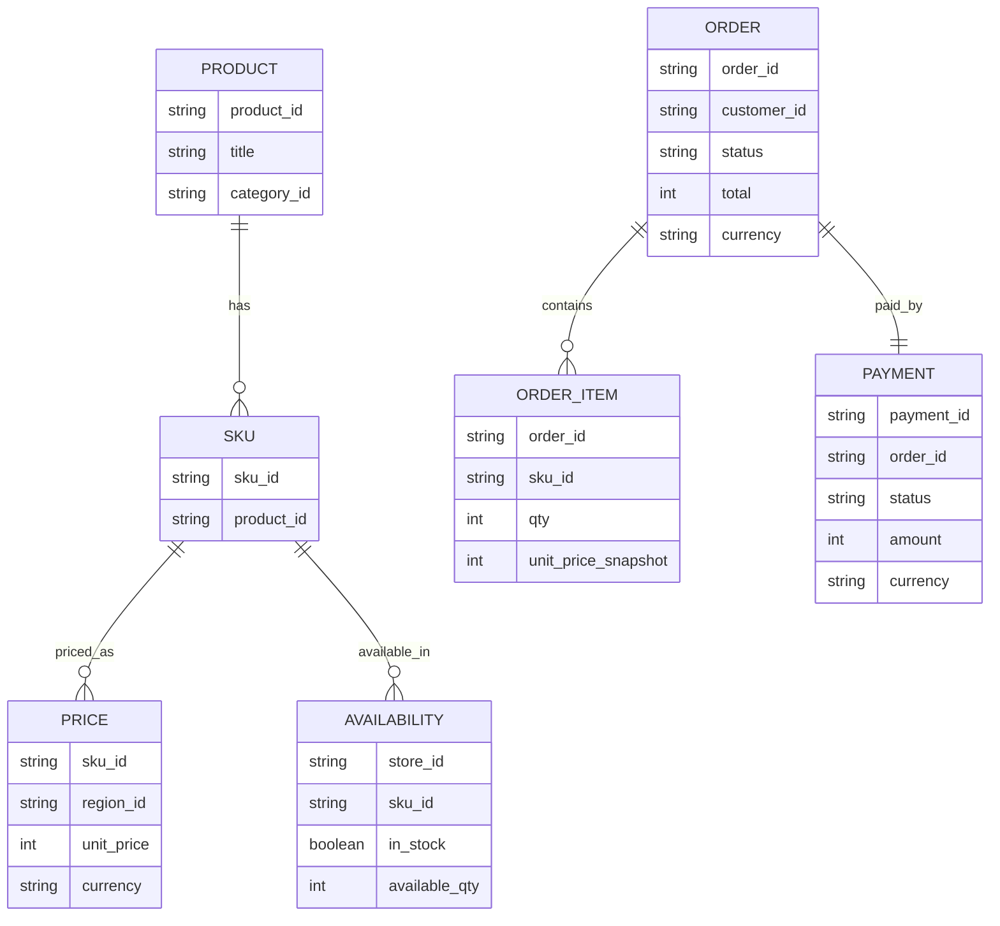
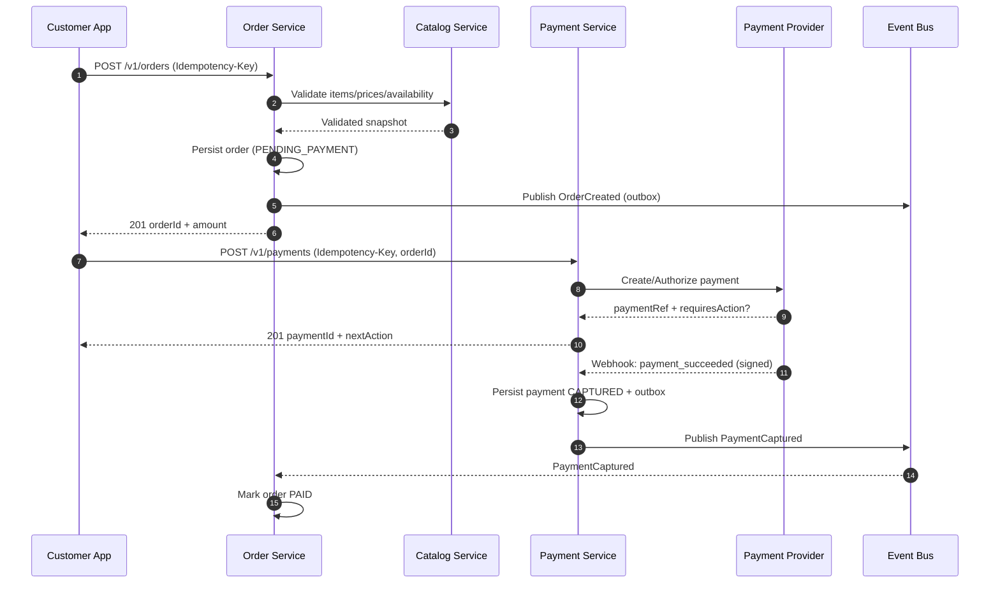
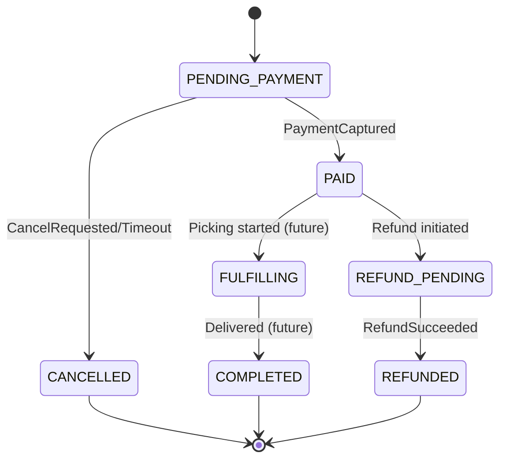
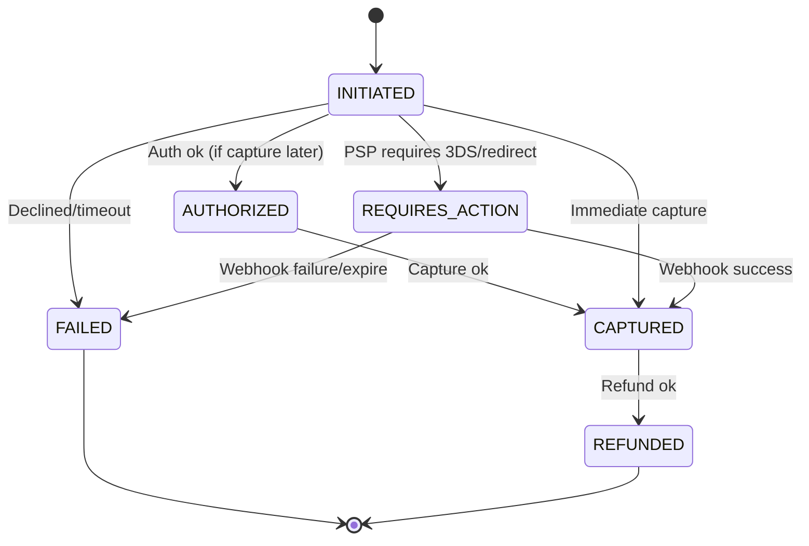

# Q-Commerce System Architecture (Order, Payment, Catalog)

Production-oriented reference architecture for a quick-commerce (Q-commerce) platform composed of **Catalog**, **Order**, and **Payment** services. The goal is fast checkout and reliable fulfillment under high concurrency, with clear separation of concerns using **Clean Architecture** per service.

---

## 1) System Context

### Actors
- **Customer App** (mobile/web): browse catalog, place orders, pay, track status.
- **Ops/Admin Portal**: manage products/prices/availability, monitor orders and payments.
- **Delivery/Fulfillment** (future): assignment, picking, dispatch, delivery tracking.
- **Payment Provider** (PSP): card/wallet payments, webhooks.
- **Notification Provider** (future): SMS/Push/Email.

### Business Capabilities (in scope)
- **Catalog**: product discovery, pricing, inventory visibility, promotions (basic).
- **Order**: cart validation, order placement, order state lifecycle, idempotency.
- **Payment**: create/confirm payments, handle PSP webhooks, reconcile and update Order.

### Mermaid: Context Diagram


---

## 2) Functional Requirements

### Catalog
- Search and browse products by category/collection.
- Return product detail including price, images, and **availability** (in-stock, quantity).
- Support price overrides (store/region) and basic promotions (optional).

### Order
- Validate cart items (exist, price, availability) at checkout time.
- Create order with line items, totals, customer details, and delivery address.
- Maintain order lifecycle with clear state transitions.
- Expose order status and history.
- Enforce **idempotency** for order creation and payment initiation.

### Payment
- Initialize payment for an order (auth/capture based on policy).
- Handle payment confirmation via synchronous redirect/SDK callback and asynchronous webhook.
- Maintain payment state machine; ensure once-only state transitions.
- Support refunds/cancellations (basic), at least full refund.

---

## 3) Non-Functional Requirements (NFRs)

### Reliability & Consistency
- Prefer **eventual consistency** between services; keep each service as the source of truth for its own data.
- Use **outbox pattern** for publishing events reliably.
- Idempotent handlers for API requests and events/webhooks.

### Performance
- P95 API latency targets (typical):
  - Catalog read APIs: **< 150ms**
  - Order create: **< 400ms**
  - Payment init: **< 500ms** (excluding PSP latency variance)
- Cache hot catalog reads (CDN/edge + service cache).

### Security
- TLS everywhere; strict authN/authZ (OAuth2/JWT for user, mTLS/service auth internally).
- Do not store raw card data; rely on PSP tokens (PCI scope minimized).
- Webhook verification (HMAC signature + replay protection).

### Observability
- Distributed tracing (trace IDs propagated via headers).
- Structured logs (JSON) with PII redaction.
- Metrics: request rate/latency/error, queue lag, payment webhook delay, order state transitions.

### Scalability
- Horizontal scaling for stateless services; DB scaling via read replicas + partitioning (later).
- Backpressure via queues for webhook/event processing.

---

## 4) High-Level Design (HLD)

### Service Boundaries
- **Catalog Service** (read-heavy): products, pricing, availability snapshots.
- **Order Service** (write-heavy): order creation and lifecycle.
- **Payment Service** (integration-heavy): PSP orchestration and payment lifecycle.

### Communication Patterns
- **Synchronous (REST/gRPC)** for user-facing flows requiring immediate response:
  - Order -> Catalog for cart validation (or snapshot pricing service).
  - Customer App -> Order, Payment.
- **Asynchronous (Events)** for cross-service state propagation:
  - `OrderCreated`, `OrderCancelled`
  - `PaymentAuthorized`, `PaymentCaptured`, `PaymentFailed`, `RefundSucceeded`

### Mermaid: Container Diagram (logical)


---

## 5) Low-Level Design (LLD) — Clean Architecture per Service

All services follow **Clean Architecture** to isolate business logic from frameworks and I/O:

**Layers**
1. **Domain**: entities, value objects, domain services, domain events, invariants.
2. **Application**: use-cases (interactors), DTOs, ports (interfaces) for repositories, clients, and message bus.
3. **Interface Adapters**: controllers/handlers, presenters/mappers, repository implementations adapters.
4. **Infrastructure**: DB, cache, queue/event-bus clients, HTTP server, PSP SDK, config, observability.

### 5.1 Catalog Service (LLD)

**Responsibilities**
- Product read model optimized for browsing/search.
- Price and availability resolution (per store/region), with caching.

**Key Components**
- **Domain**
  - `Product`, `SKU`, `Money`, `Availability`
  - Rules: product must have ≥1 SKU; price currency invariant per region.
- **Application (Use Cases)**
  - `GetProduct(productId, regionId)`
  - `SearchProducts(query, filters, sort, page)`
  - `GetAvailability(skuIds, storeId)`
  - Ports: `ProductRepository`, `PricingRepository`, `InventoryGateway`, `CachePort`
- **Interface Adapters**
  - `CatalogController` (REST)
  - Mappers: domain <-> API DTOs
- **Infrastructure**
  - Read DB (e.g., Postgres/Elastic for search), cache (Redis), optional CDN.

**Data Ownership**
- Owns: product definitions, category taxonomy, pricing rules (if centralized).
- Exposes: availability snapshots (not authoritative inventory accounting unless designed so).

### 5.2 Order Service (LLD)

**Responsibilities**
- Create and manage orders; enforce invariants and transitions.
- Maintain order totals derived from validated catalog snapshot.
- Orchestrate workflow via events (and optionally saga manager).

**Key Components**
- **Domain**
  - Entities: `Order`, `OrderItem`, `Address`, `OrderPayment` (reference)
  - Value objects: `OrderId`, `Money`, `Quantity`
  - Domain events: `OrderCreated`, `OrderCancelled`, `OrderPaid`
  - Invariants:
    - totals = Σ(item.price * qty) + fees - discounts
    - item prices are immutable after order placement (store snapshot)
- **Application (Use Cases)**
  - `CreateOrder(cart, customer, idempotencyKey)`
  - `GetOrder(orderId)`
  - `CancelOrder(orderId, reason)`
  - `MarkOrderPaid(orderId, paymentId)` (from event)
  - Ports: `OrderRepository`, `CatalogClient`, `EventPublisher`, `IdempotencyStore`
- **Interface Adapters**
  - `OrderController` (REST)
  - `PaymentEventConsumer` (subscribes to payment events)
- **Infrastructure**
  - OLTP DB (Postgres), outbox publisher, message bus client.

**Consistency Strategy**
- On `CreateOrder`, call Catalog synchronously to validate and snapshot pricing/availability.
- Payment confirmation updates Order via events; Order remains consistent even with delayed payments.

### 5.3 Payment Service (LLD)

**Responsibilities**
- Initiate payment with PSP; handle webhook callbacks; update payment state.
- Publish payment lifecycle events consumed by Order.

**Key Components**
- **Domain**
  - Entity: `Payment` (state machine)
  - Value objects: `PaymentId`, `PSPReference`, `Money`
  - Domain events: `PaymentAuthorized`, `PaymentCaptured`, `PaymentFailed`, `RefundSucceeded`
  - Invariants:
    - transitions must be monotonic; no “double capture”
    - webhook events are idempotent (dedupe by PSP event id)
- **Application (Use Cases)**
  - `InitiatePayment(orderId, amount, idempotencyKey)`
  - `HandleWebhook(pspEvent)`
  - `RefundPayment(paymentId, amount)`
  - Ports: `PaymentRepository`, `PSPClient`, `EventPublisher`, `IdempotencyStore`
- **Interface Adapters**
  - `PaymentController` (REST)
  - `WebhookController` (REST, signature verification)
- **Infrastructure**
  - DB, PSP SDK/client, webhook verification, outbox publisher.

---

## 6) API Contracts (Production-Oriented)

Conventions:
- **Idempotency** via `Idempotency-Key` header on mutating requests.
- Correlation via `X-Request-Id` (or `traceparent`).
- Errors: RFC 7807-like structure (`type`, `title`, `status`, `detail`, `instance`).

### 6.1 Catalog APIs

**GET** `/v1/products/{productId}?regionId=...`
- 200: `ProductDTO`

**GET** `/v1/products?query=&categoryId=&page=&pageSize=&sort=`
- 200: `{ items: ProductSummaryDTO[], page, pageSize, total }`

**POST** `/v1/availability:batch`
- Request: `{ storeId, skuIds: string[] }`
- Response: `{ items: { skuId, inStock: boolean, availableQty?: number }[] }`

### 6.2 Order APIs

**POST** `/v1/orders`
- Headers: `Idempotency-Key: <uuid>`
- Request:
  ```json
  {
    "customerId": "c_123",
    "storeId": "s_001",
    "items": [{"skuId":"sku_1","qty":2}],
    "address": {"line1":"...","city":"...","zip":"..."},
    "paymentMethod": {"type":"psp_token","token":"tok_..."}
  }
  ```
- Response 201:
  ```json
  {
    "orderId": "o_123",
    "status": "PENDING_PAYMENT",
    "amount": {"currency":"USD","value": 1299},
    "createdAt": "2026-01-01T12:00:00Z"
  }
  ```

**GET** `/v1/orders/{orderId}`
- 200: `OrderDTO`

**POST** `/v1/orders/{orderId}/cancel`
- 202: `{ "orderId": "...", "status": "CANCEL_REQUESTED" }`

### 6.3 Payment APIs

**POST** `/v1/payments`
- Headers: `Idempotency-Key: <uuid>`
- Request: `{ "orderId": "o_123", "amount": {"currency":"USD","value":1299} }`
- 201:
  ```json
  {
    "paymentId": "p_123",
    "status": "REQUIRES_ACTION",
    "nextAction": {"type":"redirect","url":"https://psp/..."}
  }
  ```

**POST** `/v1/webhooks/psp`
- PSP -> Payment service webhook endpoint (HMAC-signed).
- 200: acknowledgement after durable enqueue/persist (avoid timeouts).

---

## 7) Data Models

### 7.1 Catalog (example)
- `products(product_id, title, description, brand, category_id, attributes_json, active, created_at, updated_at)`
- `skus(sku_id, product_id, barcode, unit, size, active)`
- `prices(sku_id, region_id, currency, unit_price, effective_from, effective_to)`
- `availability(store_id, sku_id, in_stock, available_qty, as_of)`

### 7.2 Order
- `orders(order_id, customer_id, store_id, status, currency, subtotal, fees, discount, total, created_at, updated_at)`
- `order_items(order_id, sku_id, title_snapshot, unit_price_snapshot, qty, line_total)`
- `order_events(order_id, type, payload_json, created_at)` (optional audit)
- `idempotency_keys(key, scope, request_hash, response_json, expires_at)`

### 7.3 Payment
- `payments(payment_id, order_id, status, currency, amount, psp, psp_payment_ref, created_at, updated_at)`
- `payment_events(payment_id, type, psp_event_id, payload_json, created_at)` (dedupe + audit)
- `outbox(id, aggregate_type, aggregate_id, event_type, payload_json, created_at, published_at)`

### Mermaid: Conceptual ERD


---

## 8) Key Flows

### 8.1 Sequence: Place Order + Pay (typical)


### 8.2 State Machines

#### Order State


#### Payment State


---

## 9) Cross-Cutting Concerns (Implementation Notes)

### Idempotency
- Store `(idempotencyKey, scope)` with request hash and response; on replay return the stored response.
- Apply to: `POST /orders`, `POST /payments`, refunds, webhook ingestion.

### Outbox + Inbox
- **Outbox** table in each service DB; a publisher job sends events to the bus with at-least-once guarantees.
- Consumers implement **inbox/dedupe** by `(eventId)` or `(pspEventId)` to avoid double-processing.

### Data Privacy / PII
- Keep customer PII minimal in Order; encrypt sensitive fields at rest (address/phone) if required.
- Tokenize payment methods; never persist PAN/CVV.

---

## 10) Suggested Events (Contracts)

All events include: `eventId`, `occurredAt`, `version`, `producer`, `traceId`, and `data`.

- `OrderCreated` `{ orderId, customerId, storeId, total, currency }`
- `OrderCancelled` `{ orderId, reason }`
- `PaymentCaptured` `{ paymentId, orderId, amount, currency, psp, pspPaymentRef }`
- `PaymentFailed` `{ paymentId, orderId, reasonCode }`
- `RefundSucceeded` `{ paymentId, orderId, amount }`

